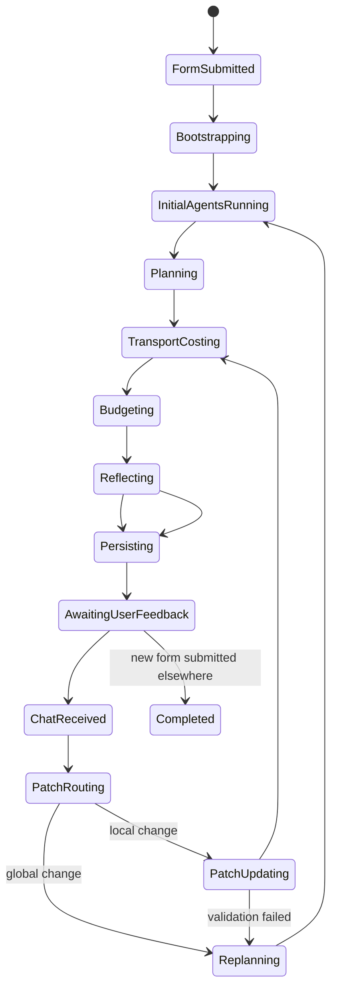
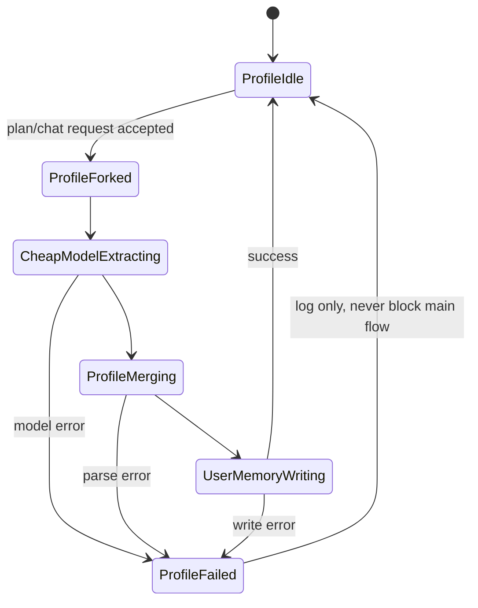
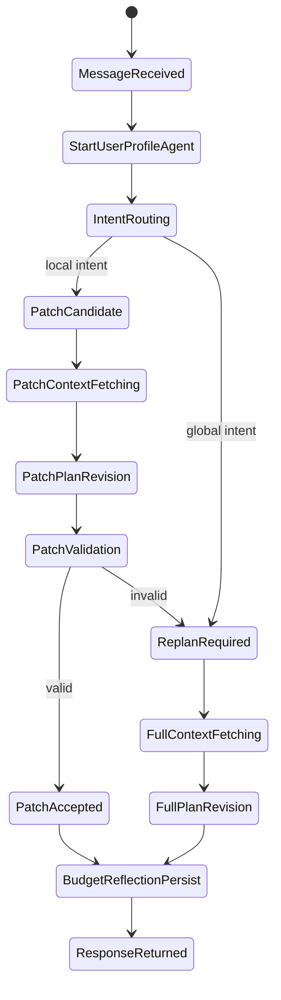
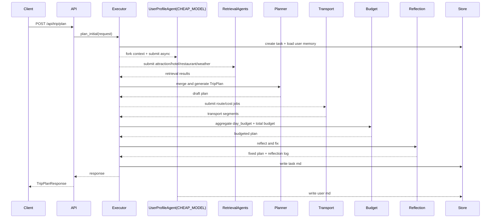
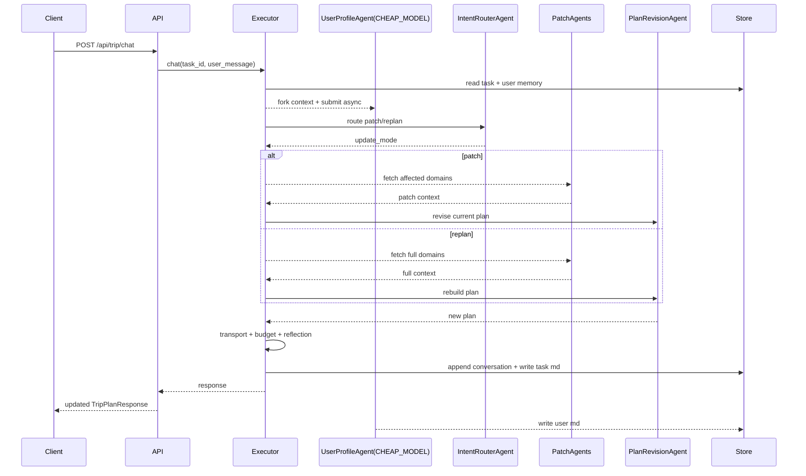

# SDD规格：多轮对话 + 并行 Subagents 旅行规划改造

## 1. 目标
- 保留现有首页表单入口，不改成纯聊天首屏。
- 初次出计划后，结果页支持多轮文字交互，用户可直接提出修改意见。
- 后端从“单次串行规划”升级为“并行检索 + 串行合并 + 自动反思 + 任务记忆 + 用户记忆”。
- 预算从总览升级为逐项可见，覆盖景点、餐饮、酒店、交通段和每日小计。

## 2. 不做范围
- 本阶段不引入数据库。
- 本阶段不做流式输出，不做 WebSocket 或 SSE。
- 本阶段不把 reflection 结果直接展示在前端。
- 本阶段不移除现有结果页的手动编辑模式，但聊天修改是主路径。

## 3. 当前现状
- 后端当前只有 `POST /api/trip/plan`，无任务 ID、无会话恢复、无聊天接口。
- 当前 `backend/app/agents/trip_planner_agent.py` 已有多 Agent 雏形，但实际执行仍是串行。
- 当前无任务记忆、无用户记忆、无反思阶段。
- 前端当前是“表单提交 -> 结果页展示”，结果页只有本地编辑，不会回写后端。
- 预算当前只有总览和景点门票展示，没有每日交通段、餐饮、酒店逐项明细。

## 4. 总体架构
### 4.1 核心对象
- `task_id`
  - 一次表单提交生成一个新任务。
  - 后续多轮聊天都绑定到同一个 `task_id`。
- `user_id`
  - 由 `nickname` 生成稳定 ID。
  - 用于长期偏好记忆。
- `TripPlan`
  - 仍是主返回对象。
  - 新增每日交通段和每日预算。

### 4.2 后端分层
- 路由层
  - 只做参数接收、响应包装、错误处理。
- 编排层
  - 负责串行/并行调度、意图路由、预算重算、reflection。
- 后台画像层
  - 负责用户画像异步提取、低成本模型调用、用户记忆回写。
- 持久化层
  - 负责 `tasks/*.md` 与 `users/*.md` 的读写。
- LLM/MCP 调用层
  - 负责景点、酒店、餐厅、天气、路线等检索。

### 4.3 建议新增或改动文件
- 修改 `[schemas.py](D:/pythonproject/helloagents-trip-planner/backend/app/models/schemas.py)`
- 修改 `[trip.py](D:/pythonproject/helloagents-trip-planner/backend/app/api/routes/trip.py)`
- 重构 `[trip_planner_agent.py](D:/pythonproject/helloagents-trip-planner/backend/app/agents/trip_planner_agent.py)`
- 新增 `backend/app/services/memory_store.py`
- 新增 `backend/app/services/task_executor.py`
- 修改 `[index.ts](D:/pythonproject/helloagents-trip-planner/frontend/src/types/index.ts)`
- 修改 `[api.ts](D:/pythonproject/helloagents-trip-planner/frontend/src/services/api.ts)`
- 修改 `[Home.vue](D:/pythonproject/helloagents-trip-planner/frontend/src/views/Home.vue)`
- 修改 `[Result.vue](D:/pythonproject/helloagents-trip-planner/frontend/src/views/Result.vue)`

## 5. Subagent 编排规则
### 5.1 必须并行的子任务
- `AttractionAgent`
  - 只负责景点候选检索。
- `HotelAgent`
  - 只负责酒店候选检索。
- `RestaurantAgent`
  - 只负责餐饮候选检索。
- `WeatherAgent`
  - 只负责天气检索。
- `TransportCostAgent`
  - 在主计划已生成后，按日程中的相邻地点并发估算交通段。
- `UserProfileAgent`
  - 后台异步更新用户长期记忆，绝不能阻塞主回复。
  - 必须与所有其他 agent 并行运行，不能等待任何主链路 agent 完成后再启动。
  - 允许 fork 主 agent 当前上下文，但只能读取上下文，不能修改主 agent 的即时决策状态。
  - 固定使用 `CHEAP_MODEL`，不能占用主规划模型。

### 5.2 必须串行的步骤
- `TaskBootstrapAgent`
  - 必须先生成 `task_id`、`user_id` 并加载用户记忆，后续上下文才能稳定。
- `PlannerAgent`
  - 必须等待景点、酒店、餐厅、天气结果齐备后再合并。
- `BudgetAggregatorAgent`
  - 必须等待交通段费用补齐后再汇总。
- `ReflectionAgent`
  - 必须拿到完整计划后做一致性修正。
- `TaskWriter`
  - 必须最后同步写任务文件，保证落盘内容是完整快照。

### 5.3 线程模型
- 检索并行池：`ThreadPoolExecutor(max_workers=4)`
- 交通估算并行池：`ThreadPoolExecutor(max_workers=8)`
- 用户画像后台池：`ThreadPoolExecutor(max_workers=1)`
- 设计原因
  - 检索任务彼此独立，适合并行。
  - 用户画像推理虽然与主链路并行，但同一用户文件写入必须串行化，避免覆盖。

### 5.4 `UserProfileAgent` 硬约束
- 启动时机
  - 初次规划：`TaskBootstrapAgent` 完成 `user_id` 与任务快照后立即启动，不等待检索 agent。
  - 多轮聊天：路由层收到 `user_message` 后立即启动，不等待 `IntentRouterAgent` 判定结果。
- 上下文来源
  - 允许 fork 主 agent 的当前输入上下文。
  - 初次规划时最少输入：表单快照、已有 `user md`、空对话历史。
  - 多轮聊天时最少输入：当前 `task md` 摘要、最新用户消息、已有 `user md`。
- 模型要求
  - 固定使用 `CHEAP_MODEL`。
  - `CHEAP_MODEL` 作为独立配置项，不与主模型共用 `LLM_MODEL_ID`。
  - 若 `CHEAP_MODEL` 未配置，可回退到主模型的更便宜别名，但仍必须通过单独配置入口控制。
- 完成语义
  - 主接口绝不等待该 agent 完成。
  - 失败只记日志，不影响 `plan/chat/task` 主接口返回。
  - 成功后异步回写 `users/{user_id}.md`，必要时追加写入 `task md` 的内部日志。

## 6. 初次规划链路
### 6.1 输入
- 首页表单提交 `TripRequest`
- 必填新增字段：`nickname`

### 6.2 执行顺序
1. `TaskBootstrapAgent`
   - 根据 `nickname` 生成稳定 `user_id`
   - 生成新 `task_id`
   - 加载或初始化 `user md`
   - 立即写入 `task md` 的初始表单快照
2. 并行启动
   - `UserProfileAgent`
3. 并行执行
   - `AttractionAgent`
   - `HotelAgent`
   - `RestaurantAgent`
   - `WeatherAgent`
4. `PlannerAgent`
   - 输入：表单、用户记忆摘要、四类检索结果
   - 输出：初稿 `TripPlan`
5. `TransportCostAgent`
   - 按天扫描地点顺序生成交通段
   - 并发补足每段 `distance/duration/estimated_cost/cost_source`
6. `BudgetAggregatorAgent`
   - 生成 `day_budget`
   - 生成总 `budget`
7. `ReflectionAgent`
   - 修正结构和预算一致性
8. `TaskWriter`
   - 同步写 `task md`
9. 返回前端

### 6.3 交通段顺序规则
- 每天默认生成以下段
- `hotel -> attraction[0]`
- `attraction[i] -> attraction[i+1]`
- `last attraction -> hotel`
- 若当天无酒店，则从第一个景点开始串联景点。
- 若当天只有一个景点，则保留 `hotel -> attraction` 与 `attraction -> hotel` 两段。

## 7. 多轮修订链路
### 7.1 输入
- `task_id`
- `user_message`

### 7.2 意图路由
- 命中 `replan`
  - 修改城市
  - 修改日期
  - 修改天数
  - 修改全局交通方式
  - 修改全局住宿偏好
  - 关键词包含“重做”“重新规划”“全部重排”“整体改”
- 其余情况先按 `patch` 处理

### 7.3 `patch` 执行
1. 后台异步提交 `UserProfileAgent`
2. 根据消息命中受影响域并行拉取数据
   - 提到“吃”“餐厅”“晚饭” -> `RestaurantAgent`
   - 提到“酒店”“住宿” -> `HotelAgent`
   - 提到“下雨”“天气” -> `WeatherAgent`
   - 其他默认拉 `AttractionAgent`
3. `PlanRevisionAgent`
   - 输入：当前计划、用户消息、局部新数据
   - 输出：完整新 `TripPlan`
4. 预算重算
5. reflection 修正
6. 覆写 `task md` 当前计划快照并追加对话日志

### 7.4 `replan` 执行
1. 后台异步提交 `UserProfileAgent`
2. 将 `user_message` 合并进原始表单约束
3. 复用初次规划链路
4. 保留原 `task_id`，只更新任务内容，不新建任务

### 7.5 `patch` 失败回退条件
- 新计划 JSON 解析失败
- 新计划字段缺失
- 日期天数不一致
- 预算总和不一致
- reflection 发现高风险冲突
- 命中以上任一条件时自动回退到 `replan`

## 8. API 设计
### 8.1 `POST /api/trip/plan`
请求体：
```json
{
  "nickname": "Alice",
  "city": "北京",
  "start_date": "2026-05-01",
  "end_date": "2026-05-03",
  "travel_days": 3,
  "transportation": "公共交通",
  "accommodation": "舒适型酒店",
  "preferences": ["历史文化", "美食"],
  "free_text_input": "希望晚上安排安静一点"
}
```

响应体：
```json
{
  "success": true,
  "message": "旅行计划生成成功",
  "task_id": "task_20260423_ab12cd34",
  "user_id": "alice_4f92b1",
  "update_mode": "initial",
  "assistant_message": "已生成初步计划，你可以继续直接提意见让我修改。",
  "data": {}
}
```

### 8.2 `POST /api/trip/chat`
请求体：
```json
{
  "task_id": "task_20260423_ab12cd34",
  "user_message": "把第二天下午换成博物馆，晚饭预算控制在80以内"
}
```

响应体：
```json
{
  "success": true,
  "message": "旅行计划更新成功",
  "task_id": "task_20260423_ab12cd34",
  "user_id": "alice_4f92b1",
  "update_mode": "patch",
  "assistant_message": "已调整第二天下午行程，并将晚餐预算收紧到80元以内。",
  "data": {}
}
```

### 8.3 `GET /api/trip/task/{task_id}`
响应体：
```json
{
  "success": true,
  "message": "任务加载成功",
  "task_id": "task_20260423_ab12cd34",
  "user_id": "alice_4f92b1",
  "update_mode": "restore",
  "assistant_message": "",
  "data": {}
}
```

## 9. 数据模型设计
### 9.1 `TripRequest`
- 新增 `nickname: str`

### 9.2 新增 `TransportSegment`
```json
{
  "from_name": "酒店A",
  "to_name": "故宫博物院",
  "mode": "公共交通",
  "distance": 3200,
  "duration": 1800,
  "estimated_cost": 4,
  "cost_source": "route_estimate"
}
```

字段约束：
- `distance`
  - 单位米
- `duration`
  - 单位秒
- `cost_source`
  - 枚举：`route_fee`、`route_estimate`、`rule_based`

### 9.3 新增 `DayBudget`
```json
{
  "attractions": 120,
  "meals": 180,
  "hotel": 520,
  "transportation": 18,
  "subtotal": 838
}
```

### 9.4 `DayPlan`
- 新增 `transport_segments: List[TransportSegment]`
- 新增 `day_budget: DayBudget`

### 9.5 统一响应模型
- 现有 `TripPlanResponse` 扩展为会话响应
- 新增字段
  - `task_id`
  - `user_id`
  - `update_mode`
  - `assistant_message`

## 10. 预算规则
### 10.1 门票
- 使用景点自身 `ticket_price`
- 缺失时默认 `0`

### 10.2 餐饮默认值
- 早餐：`25`
- 午餐：`60`
- 晚餐：`90`
- 小吃：`30`
- 若 LLM 返回 `estimated_cost`，直接采用

### 10.3 酒店默认值
- `经济型酒店`：`300`
- `舒适型酒店`：`500`
- `豪华酒店`：`900`
- `民宿`：`450`
- 若酒店项已有 `estimated_cost`，优先使用已有值

### 10.4 交通费用优先级
1. 路线结果里若存在明确费用字段，记为 `route_fee`
2. 若只有距离和时长，按交通方式估算，记为 `route_estimate`
3. 若路线调用失败，直接按规则估算，记为 `rule_based`

### 10.5 交通估算公式
- `步行`
  - 费用固定 `0`
- `公共交通`
  - `max(2, ceil(distance_km * 0.8))`
  - 上限 `20`
- `自驾`
  - `ceil(distance_km * 0.9)`
- `混合`
  - `distance < 1.5km` 用 `步行`
  - `distance >= 1.5km` 用 `公共交通`

### 10.6 汇总规则
- `day_budget.attractions = sum(ticket_price)`
- `day_budget.meals = sum(meal.estimated_cost)`
- `day_budget.hotel = hotel.estimated_cost or 0`
- `day_budget.transportation = sum(segment.estimated_cost)`
- `day_budget.subtotal = 四项之和`
- `budget.total = total_attractions + total_meals + total_hotels + total_transportation`

## 11. Reflection 规则
### 11.1 检查项
- 日期数量是否等于 `travel_days`
- 每日 `date` 是否连续
- 每日至少 1 个景点
- 每日至少包含早餐、午餐、晚餐
- `transport_segments` 是否存在并可串联
- `day_budget.subtotal` 是否正确
- `budget.total` 是否正确
- `weather_info` 是否覆盖每天

### 11.2 修正顺序
1. 补齐缺失字段
2. 重算每日预算
3. 重算总预算
4. 记录 reflection 日志

### 11.3 输出策略
- reflection 不改变前端展示结构
- reflection 结果只写入 `task md` 的 `Reflection Log`

## 12. Markdown 持久化规范
### 12.1 目录
- `backend/runtime_data/tasks/`
- `backend/runtime_data/users/`

### 12.2 `task md` 文件结构
- 固定 front matter
- 固定 section 顺序
- `Form Snapshot`
- `Conversation Log`
- `Current Plan`
- `Budget Ledger`
- `Reflection Log`

### 12.3 `user md` 文件结构
- 固定 front matter
- `Profile`
- `Update History`

### 12.4 读写规则
- 每次主链路更新任务时，重写整个 `task md`
- 用户记忆更新时，读取旧文件，做集合去重后写回整个 `user md`
- 去重键
  - `preferences`
  - `dislikes`
  - `constraints`
  - `notes`

### 12.5 用户记忆提取规则
- 聊天消息出现“喜欢”“更喜欢”“偏好” -> 写入 `preferences`
- 出现“不吃”“讨厌”“避免” -> 写入 `dislikes` 或 `constraints`
- 出现“预算控制”“便宜点”“贵一点也行” -> 更新 `budget_sensitivity`
- 只记录稳定偏好，不记录一次性具体行程要求到 `user md`
- 以上规则由 `UserProfileAgent` 使用 `CHEAP_MODEL` 做语义抽取，规则层只做兜底和字段归并。

## 12.6 `CHEAP_MODEL` 配置
- 新增独立环境变量
  - `CHEAP_MODEL`
  - `CHEAP_MODEL_BASE_URL`
  - `CHEAP_MODEL_API_KEY`
- `UserProfileAgent` 只读取这组配置。
- 主规划模型继续读取现有主模型配置，不与 `CHEAP_MODEL` 混用。
- 若 `CHEAP_MODEL` 缺失，系统允许降级，但必须在日志中显式记录本轮画像更新未使用便宜模型。

## 13. 前端改造
### 13.1 首页 `[Home.vue](D:/pythonproject/helloagents-trip-planner/frontend/src/views/Home.vue)`
- 在目的地与日期区新增昵称输入框
- 提交时将 `nickname` 一并发给后端
- 成功后不只保存 `tripPlan`
- 同时保存
  - `task_id`
  - `user_id`
  - `assistant_message`
  - `update_mode`

### 13.2 类型 `[index.ts](D:/pythonproject/helloagents-trip-planner/frontend/src/types/index.ts)`
- 扩展 `TripFormData`
- 新增 `TransportSegment`
- 新增 `DayBudget`
- 扩展 `DayPlan`
- 扩展 `TripPlanResponse`
- 新增 `TripChatRequest`
- 新增 `TripSessionState`

### 13.3 API `[api.ts](D:/pythonproject/helloagents-trip-planner/frontend/src/services/api.ts)`
- 保留 `generateTripPlan`
- 新增 `chatWithTrip`
- 新增 `getTripTask`

### 13.4 结果页 `[Result.vue](D:/pythonproject/helloagents-trip-planner/frontend/src/views/Result.vue)`
- 现有左导航保留
- 主体改为三列
  - 左侧导航
  - 中间主结果
  - 右侧聊天卡片
- 聊天卡片内容
  - 历史消息列表
  - 输入框
  - 发送按钮
  - “本轮更新方式”标签：`initial/patch/replan`
- 页面挂载时优先读 sessionStorage 中的 `task_id`
- 若有 `task_id`，调用 `GET /api/trip/task/{task_id}` 恢复任务

### 13.5 预算展示改造
- 顶部总预算卡保留
- 每天新增“交通安排”区块
- 每段交通显示
  - 起点
  - 终点
  - 方式
  - 距离
  - 时长
  - 费用
  - 费用来源
- 餐饮项后显示 `estimated_cost`
- 酒店卡显示 `estimated_cost`
- 每天尾部显示 `day_budget.subtotal`

## 14. 实施顺序
1. 写 `spec/` 文档并冻结方案
2. 改 `schemas.py` 与前端 `types`
3. 加入 markdown 持久化服务
4. 重构后端 trip 编排服务
5. 增加聊天与任务恢复 API
6. 改首页昵称提交
7. 改结果页聊天区与预算明细
8. 跑构建与基础联调

## 15. 验收标准
- 首次提交表单后，返回 `task_id`、`user_id`，并生成一个新 `task md`
- 同一任务内连续聊天不会生成新 `task_id`
- 重新提交首页表单会生成新 `task_id`
- 聊天修改后，页面中的计划、地图、预算同步刷新
- 用户长期偏好文件异步更新，不阻塞主接口返回
- 用户画像 agent 与主链路 agent 全程并行，且使用 `CHEAP_MODEL`
- 每日预算与总预算可以通过程序校验通过
- reflection 日志写入任务文件，但前端不显示

## 16. 实现清单
### 16.1 后端模型
- 修改 `TripRequest`
  - 新增 `nickname: str`
  - 保持现有字段兼容
- 新增 `TripChatRequest`
  - `task_id: str`
  - `user_message: str`
- 新增 `TransportSegment`
  - `from_name: str`
  - `to_name: str`
  - `mode: str`
  - `distance: float`
  - `duration: int`
  - `estimated_cost: int`
  - `cost_source: str`
- 新增 `DayBudget`
  - `attractions: int`
  - `meals: int`
  - `hotel: int`
  - `transportation: int`
  - `subtotal: int`
- 修改 `DayPlan`
  - 新增 `transport_segments: List[TransportSegment] = []`
  - 新增 `day_budget: DayBudget`
- 修改 `TripPlanResponse`
  - 新增 `task_id: Optional[str]`
  - 新增 `user_id: Optional[str]`
  - 新增 `update_mode: str`
  - 新增 `assistant_message: str`

### 16.2 后端配置
- 修改 `Settings`
  - 新增 `cheap_model: str`
  - 新增 `cheap_model_base_url: str`
  - 新增 `cheap_model_api_key: str`
- 新增 cheap model 获取函数
  - 位置建议：`backend/app/services/llm_service.py`
  - 函数名建议：`get_cheap_llm()`
  - 只供 `UserProfileAgent` 使用
- 日志要求
  - 若 `CHEAP_MODEL` 未配置，必须输出降级日志
  - 降级不能影响主接口返回

### 16.3 Markdown 持久化服务
- 新增 `backend/app/services/memory_store.py`
- 必须提供以下能力
  - `ensure_runtime_dirs()`
  - `create_task_id()`
  - `build_user_id(nickname: str)`
  - `load_or_create_user_memory(user_id: str, nickname: str)`
  - `read_task(task_id: str)`
  - `write_task(task_record: dict)`
  - `append_task_conversation(task_id: str, entries: list)`
  - `write_user_memory(user_id: str, profile: dict, update_entry: dict)`
  - `extract_json_section(markdown: str, section_name: str)`
  - `render_task_markdown(task_record: dict)`
  - `render_user_markdown(user_record: dict)`
- 写文件规则
  - 先写临时文件，再原子替换目标文件
  - `task md` 主链路同步写
  - `user md` 只能由用户画像后台池写

### 16.4 用户画像 Agent
- 建议文件：`backend/app/agents/user_profile_agent.py`
- 类名：`UserProfileAgent`
- 模型：固定 `get_cheap_llm()`
- 启动方式：后台 executor `submit`
- 输入：fork 后的只读上下文
- 输出：用户画像 patch
- 回写：`users/{user_id}.md`
- 失败策略：只记录日志，不抛到主链路

### 16.5 旅行编排服务
- 建议新增 `backend/app/services/task_executor.py`
- 类名：`TripTaskExecutor`
- 公开方法
  - `plan_initial(request: TripRequest) -> TripPlanResponse`
  - `chat(request: TripChatRequest) -> TripPlanResponse`
  - `restore(task_id: str) -> TripPlanResponse`
- 内部方法
  - `_bootstrap_task`
  - `_start_user_profile_update`
  - `_fetch_initial_context_parallel`
  - `_route_revision_intent`
  - `_fetch_patch_context_parallel`
  - `_run_planner`
  - `_run_revision`
  - `_add_transport_segments_parallel`
  - `_aggregate_budget`
  - `_reflect_and_fix`
  - `_write_task_snapshot`

### 16.6 Agent 复用策略
- 当前 `MultiAgentTripPlanner` 可继续作为底层 agent 容器。
- 需要补充 `RestaurantAgent`。
- 需要避免在每个请求中重复初始化 MCP 工具。
- `PlannerAgent`、`PlanRevisionAgent`、`ReflectionAgent` 可以先复用同一个主 LLM，但 prompt 必须分离。
- `UserProfileAgent` 必须单独使用 `CHEAP_MODEL`。

### 16.7 API 路由
- 修改 `POST /api/trip/plan`
  - 调用 `TripTaskExecutor.plan_initial`
  - 返回扩展后的 `TripPlanResponse`
- 新增 `POST /api/trip/chat`
  - 调用 `TripTaskExecutor.chat`
- 新增 `GET /api/trip/task/{task_id}`
  - 调用 `TripTaskExecutor.restore`
- 修复现有 `/trip/health`
  - 当前引用 `agent.agent` 不存在，应改为检查 executor 或 planner 容器状态

### 16.8 前端类型和 API
- 修改 `frontend/src/types/index.ts`
  - 与后端模型保持字段同名
- 修改 `frontend/src/services/api.ts`
  - `generateTripPlan`
  - `chatWithTrip`
  - `getTripTask`
- sessionStorage key
  - `tripPlan`
  - `tripTaskId`
  - `tripUserId`
  - `tripAssistantMessage`
  - `tripUpdateMode`

### 16.9 前端页面
- `Home.vue`
  - 新增昵称输入
  - 提交时带上 `nickname`
  - 保存 `task_id/user_id`
- `Result.vue`
  - 右侧新增聊天卡片
  - 页面加载时优先通过 `task_id` 恢复
  - 聊天成功后替换 `tripPlan`
  - 替换后重新加载图片和重建地图
  - 每日行程展示交通段和每日预算

### 16.10 最低测试清单
- 后端导入测试
  - `python -m compileall backend/app`
- 前端类型与构建
  - `npm run build`
- 手工接口测试
  - `POST /api/trip/plan`
  - `POST /api/trip/chat`
  - `GET /api/trip/task/{task_id}`
- 文件落盘检查
  - `backend/runtime_data/tasks/{task_id}.md`
  - `backend/runtime_data/users/{user_id}.md`

## 17. 关键伪代码
### 17.1 初次规划
```python
def plan_initial(request: TripRequest) -> TripPlanResponse:
    task = bootstrap_task(request)
    user_memory = memory_store.load_or_create_user_memory(
        task.user_id,
        request.nickname,
    )

    profile_context = fork_context({
        "kind": "initial",
        "task_id": task.task_id,
        "user_id": task.user_id,
        "form": request.model_dump(),
        "user_memory": user_memory,
        "conversation": [],
    })

    # Do not wait for this future anywhere in the main request path.
    user_profile_future = user_profile_executor.submit(
        user_profile_agent.update_profile,
        profile_context,
    )

    retrieval_futures = {
        "attractions": retrieval_executor.submit(attraction_agent.run, request),
        "hotels": retrieval_executor.submit(hotel_agent.run, request),
        "restaurants": retrieval_executor.submit(restaurant_agent.run, request),
        "weather": retrieval_executor.submit(weather_agent.run, request),
    }

    retrieval_results = wait_all(retrieval_futures)

    raw_plan_text = planner_agent.run({
        "request": request.model_dump(),
        "user_memory": user_memory,
        "retrieval_results": retrieval_results,
    })

    plan = parse_trip_plan_or_fallback(raw_plan_text, request)
    plan = add_transport_segments_parallel(plan, request.transportation)
    plan = aggregate_budget(plan, request.accommodation)
    plan, reflection = reflect_and_fix(plan, request)

    task_record = build_task_record(
        task=task,
        form=request.model_dump(),
        conversation=[
            assistant_entry("已生成初步计划，你可以继续直接提意见让我修改。", "initial"),
        ],
        plan=plan,
        reflection=reflection,
        update_mode="initial",
    )
    memory_store.write_task(task_record)

    return TripPlanResponse(
        success=True,
        message="旅行计划生成成功",
        task_id=task.task_id,
        user_id=task.user_id,
        update_mode="initial",
        assistant_message="已生成初步计划，你可以继续直接提意见让我修改。",
        data=plan,
    )
```

### 17.2 多轮聊天
```python
def chat(request: TripChatRequest) -> TripPlanResponse:
    task_record = memory_store.read_task(request.task_id)
    current_plan = task_record.current_plan
    user_memory = memory_store.load_or_create_user_memory(
        task_record.user_id,
        task_record.nickname,
    )

    profile_context = fork_context({
        "kind": "chat",
        "task_id": task_record.task_id,
        "user_id": task_record.user_id,
        "task_summary": summarize_task(task_record),
        "latest_user_message": request.user_message,
        "user_memory": user_memory,
    })

    # Starts before intent routing and is never awaited by the main chain.
    user_profile_future = user_profile_executor.submit(
        user_profile_agent.update_profile,
        profile_context,
    )

    update_mode = route_revision_intent(request.user_message, task_record.form)

    if update_mode == "patch":
        patch_context = fetch_patch_context_parallel(request.user_message, current_plan)
        revised_plan = plan_revision_agent.run({
            "current_plan": current_plan.model_dump(),
            "user_message": request.user_message,
            "patch_context": patch_context,
            "user_memory": user_memory,
        })
        plan = parse_trip_plan_or_raise(revised_plan)

        if not validate_patch_result(plan, task_record.form):
            update_mode = "replan"

    if update_mode == "replan":
        merged_request = merge_user_message_into_form(
            task_record.form,
            request.user_message,
        )
        plan = replan_with_existing_task(merged_request, task_record, user_memory)

    plan = add_transport_segments_parallel(plan, task_record.form["transportation"])
    plan = aggregate_budget(plan, task_record.form["accommodation"])
    plan, reflection = reflect_and_fix(plan, task_record.form)

    assistant_message = build_revision_message(update_mode, request.user_message)
    task_record.conversation.extend([
        user_entry(request.user_message),
        assistant_entry(assistant_message, update_mode),
    ])
    task_record.current_plan = plan
    task_record.reflection_log.append(reflection)
    task_record.update_mode = update_mode
    memory_store.write_task(task_record)

    return TripPlanResponse(
        success=True,
        message="旅行计划更新成功",
        task_id=task_record.task_id,
        user_id=task_record.user_id,
        update_mode=update_mode,
        assistant_message=assistant_message,
        data=plan,
    )
```

### 17.3 用户画像 Agent
```python
class UserProfileAgent:
    def __init__(self, memory_store: MemoryStore):
        self.llm = get_cheap_llm()
        self.memory_store = memory_store

    def update_profile(self, forked_context: dict) -> None:
        try:
            user_id = forked_context["user_id"]
            current_memory = self.memory_store.load_user_memory(user_id)

            prompt = build_user_profile_prompt(
                current_memory=current_memory,
                forked_context=forked_context,
            )
            raw = self.llm.generate(prompt)
            profile_patch = parse_profile_patch(raw)

            profile_patch = merge_rule_based_fallback(
                profile_patch,
                forked_context,
            )
            next_memory = merge_user_profile(current_memory, profile_patch)

            self.memory_store.write_user_memory(
                user_id=user_id,
                profile=next_memory["profile"],
                update_entry={
                    "source_task_id": forked_context["task_id"],
                    "source_message": forked_context.get("latest_user_message", ""),
                    "applied_changes": profile_patch,
                },
            )
        except Exception as exc:
            logger.exception("UserProfileAgent failed without blocking main flow: %s", exc)
```

### 17.4 fork 上下文
```python
def fork_context(source: dict) -> dict:
    # Deep copy prevents the background agent from mutating main-chain state.
    return json.loads(json.dumps(source, ensure_ascii=False))
```

### 17.5 并行检索
```python
def wait_all(futures: dict[str, Future]) -> dict:
    results = {}
    for name, future in futures.items():
        try:
            results[name] = future.result(timeout=AGENT_TIMEOUT_SECONDS)
        except Exception as exc:
            logger.exception("%s failed, using empty fallback: %s", name, exc)
            results[name] = ""
    return results
```

### 17.6 交通段和预算
```python
def add_transport_segments_parallel(plan: TripPlan, mode: str) -> TripPlan:
    segment_jobs = []

    for day in plan.days:
        point_pairs = build_day_point_pairs(day)
        for from_point, to_point in point_pairs:
            segment_jobs.append((day.day_index, from_point, to_point))

    futures = [
        transport_executor.submit(estimate_transport_segment, job, mode)
        for job in segment_jobs
    ]

    segments_by_day = defaultdict(list)
    for future in futures:
        segment = future.result()
        segments_by_day[segment.day_index].append(segment)

    for day in plan.days:
        day.transport_segments = segments_by_day[day.day_index]

    return plan

def aggregate_budget(plan: TripPlan, accommodation: str) -> TripPlan:
    total_attractions = 0
    total_hotels = 0
    total_meals = 0
    total_transportation = 0

    for day in plan.days:
        normalize_meal_costs(day.meals)
        normalize_hotel_cost(day.hotel, accommodation)

        attractions = sum(item.ticket_price or 0 for item in day.attractions)
        meals = sum(item.estimated_cost or 0 for item in day.meals)
        hotel = day.hotel.estimated_cost if day.hotel else 0
        transportation = sum(item.estimated_cost for item in day.transport_segments)

        day.day_budget = DayBudget(
            attractions=attractions,
            meals=meals,
            hotel=hotel,
            transportation=transportation,
            subtotal=attractions + meals + hotel + transportation,
        )

        total_attractions += attractions
        total_hotels += hotel
        total_meals += meals
        total_transportation += transportation

    plan.budget = Budget(
        total_attractions=total_attractions,
        total_hotels=total_hotels,
        total_meals=total_meals,
        total_transportation=total_transportation,
        total=total_attractions + total_hotels + total_meals + total_transportation,
    )
    return plan
```

### 17.7 Reflection
```python
def reflect_and_fix(plan: TripPlan, form: dict) -> tuple[TripPlan, dict]:
    notes = []

    if len(plan.days) != form["travel_days"]:
        notes.append("day_count_mismatch")
        plan = fix_day_count(plan, form)

    for day in plan.days:
        if not day.attractions:
            notes.append(f"day_{day.day_index}_missing_attractions")
            day.attractions = build_fallback_attractions(form["city"])

        ensure_three_meals(day)
        ensure_transport_segments(day)

    plan = aggregate_budget(plan, form["accommodation"])

    reflection = {
        "timestamp": now_iso(),
        "status": "fixed" if notes else "ok",
        "notes": notes,
    }
    return plan, reflection
```

### 17.8 Markdown 写入
```python
def write_markdown_atomic(path: Path, content: str) -> None:
    tmp_path = path.with_suffix(path.suffix + ".tmp")
    tmp_path.write_text(content, encoding="utf-8")
    tmp_path.replace(path)
```

## 18. 状态转移图
### 18.1 任务状态


### 18.2 用户画像状态


### 18.3 `patch/replan` 状态


## 19. 并发时序图
### 19.1 初次规划并发时序


### 19.2 多轮聊天并发时序

